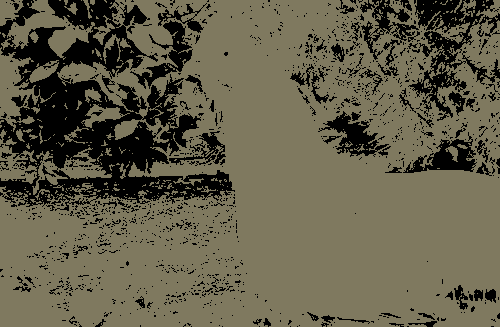

# monochrome layers



Create layers of single-color pixel grids that approximate an image

```
Usage: image-squares [OPTIONS] --input-file <INPUT_FILE>

Options:
  -i, --input-file <INPUT_FILE>  Path to the image to approximate
  -o, --output-dir <OUTPUT_DIR>  Output directory [default: ./layers_output]
  -s, --size <SIZE>              Size of the output image [default: 150]
  -l, --layers <LAYERS>          Number of layers to create [default: 8]
  -m, --min-alpha <MIN_ALPHA>    Minimum transparency of the layers [default: 0.2]
  -M, --max-alpha <MAX_ALPHA>    Maximum transparency of the layers [default: 1]
  -v, --video                    Whether input is a video or not
      --start-time <START_TIME>  Video start time (in seconds) [default: 0]
      --end-time <END_TIME>      Video end time (in seconds) [default: 10]
      --fps <FPS>                Frames per second of output [default: 30]
  -h, --help                     Print help
  -V, --version                  Print version
```

## Basic usage

```bash
git clone https://github.com/Ashwagandhae/monochrome-layers.git
cd monochrome-layers
cargo run --release -- --input-file path/to/image.jpg
```

Will create a directory `layers_output`, with 4 files:

1. `processed.jpg` - the original image resized to the output size
2. `layers.jpg` - the approximation of the image created by the layers
3. `layers.gif` - a gif of the layers being drawn
4. `grids.json` - a json file with a list of objects containing what color each layer is and which pixels it covers
